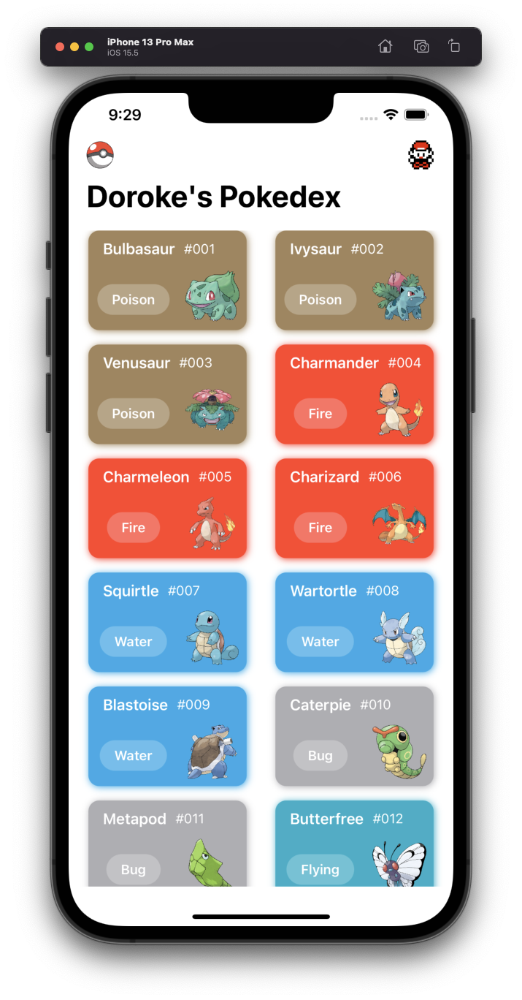
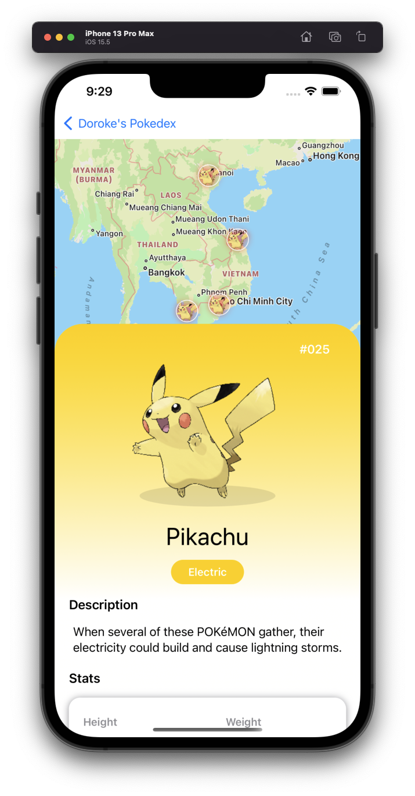

 
    <h1>Pokedex for iOS</h1> 
      
      
      
      

    
    

## Table of Contents

- [About](#about)
- [Requirements](#requirements)
- [Features](#features)
- [Demo video](#demo)
- [Acknowledgement](#acknowledgement)
- [Connections](#connections)

# About

> The Pokédex (ポケモン図鑑ずかん, Pokemon Zukan, Illustrated Pokémon Encyclopedia) is an electronic device created and designed to catalog and provide information regarding the various species of Pokémon featured in the Pokémon video game, anime and manga series. The name Pokédex is a neologism including "Pokémon" (which itself is a portmanteau of "pocket" and "monster") and "index". The Japanese name is simply "Pokémon Encyclopedia", as it can feature every Pokémon on it, depending on the Pokédex. - <a href="https://pokemon.fandom.com/wiki/Pok%C3%A9dex" target="_blank">Pokemon Fandom Wiki</a>

This is my very first iOS app I ever made, and I'm already lovin' iOS development 😍. I chose Pokedex as Pokemon was my best childhood game. I remember I would wake up at 6am to train some of my Pokemons before school when I was in elementary school. I hope this app also brings back some good memory if you happen to be a Pokemon fan like me.

This app features 151 Pokemons in the first generation with all the core functionalities search as search by name, ID or type; a map view to display the randomly spawn locations (similar to Pokemon GO).

# Requirements

This app is built with:

- Deployment target: iOS 15.5
- XCode 13.4.1
- Swift 5.5.2
- SwiftUI 3
- Additional package: Kingfisher 7.0.0
- Internet connection for fetching Pokemon data

# Features

<!-- row 1 -->

**Add Pokemon to Favorite list**

**Remove Pokemon from Favorite list**

<!-- row 2 -->

**Filtering by Pokemon, ID and type**

**Map View:** random spawn locations

<!-- row 3 -->

**Barchart animation**

**Trainer information**

# Demo video

Full demo video on the iPhone 12: https://youtu.be/HMcu9xeMLvU

# Acknowledgement
Some design and ideas are from these sources:
- AppStuff's tutorial and API: https://www.youtube.com/watch?v=f66ZCKEIZd4
- https://github.com/oskarko/Pokedex
- https://github.com/MatheusPires99/pokedex

# Connections

* <a href="https://hoangdesu.com/" target="_blank">Website</a>
* <a href="https://www.linkedin.com/in/hoangdesu/" target="_blank">LinkedIn</a>
* <a href="https://www.facebook.com/Hoangdayo/" target="_blank">Facebook</a>
* <a href="https://www.instagram.com/hoang.desu/" target="_blank">Instagram</a>
* <a href="mailto:hoangdesu@gmail.com" target="_blank">Email</a>

---
If you find this project useful, drop me a star ⭐️. I would love to hear about it!
